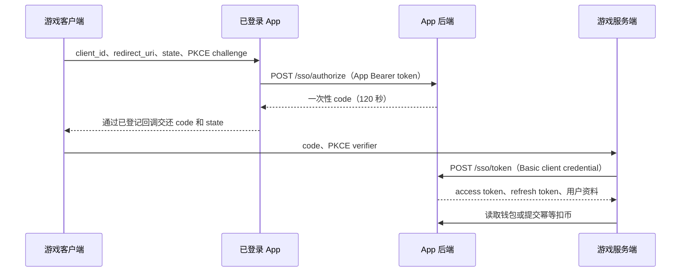

# 游戏单点登录与樱花币接口

本文档面向游戏客户端与游戏服务端。接口前缀由后端 `API_PREFIX` 决定，生产环境通常为：

```text
https://<app-backend>/novel-api
```

所有请求必须使用 HTTPS。示例中的 client ID、密钥、令牌和订单号均为占位值。

## 1. 接入模型

App 后端是用户身份和樱花币余额的唯一数据源。游戏不创建第二份余额：

- 昵称、头像与余额始终从 App 后端实时读取。
- App 签到获得 500 樱花币后，游戏读取到的余额立即增加 500。
- 游戏抽卡扣币直接扣同一个 `users.sakura_coins` 余额。
- 所有币变动写入统一 `user_reward_events` 流水；游戏请求另有幂等回执。



这是面向 Sakura App 的 JSON SSO 协议，不宣称兼容通用 OAuth 2.0/OIDC 客户端。后端已经提供安全授权原语；“点击游戏登录后唤起 App、确认并回跳游戏”的客户端 deep link/确认页需要 App 与游戏按上图接入。

## 2. 客户端开通

只在生产服务器上执行。`client_secret` 仅在创建或轮换时返回一次，数据库只保存哈希。

```bash
cd /opt/novel-interaction-backend/backend
npm run sso:client -- create \
  --id sakura-game \
  --name "Sakura Game" \
  --redirect-uri "sakura-game://sso/callback" \
  --scopes "profile:read wallet:read wallet:debit" \
  --max-debit 10000 \
  --daily-debit 100000
```

常用管理命令：

```bash
npm run sso:client -- list
npm run sso:client -- rotate --id sakura-game
npm run sso:client -- disable --id sakura-game
npm run sso:client -- enable --id sakura-game
npm run sso:client -- update --id sakura-game \
  --redirect-uri "sakura-game://sso/callback" \
  --max-debit 20000 \
  --daily-debit 200000
```

更新权限、回调地址或额度会撤销该客户端的现有授权码和令牌。轮换密钥后旧密钥立即失效。

客户端默认只有 `profile:read wallet:read`，所有写额度默认为 0。启用 `wallet:debit` 时必须同时显式设置 `--max-debit` 与 `--daily-debit`，缺少任一项都会拒绝创建或更新。

`wallet:credit` 等同增发充值钻石，默认关闭。确需退款或发奖时，必须同时设置单笔和每日正数额度：

```bash
--scopes "profile:read wallet:read wallet:debit wallet:credit" \
--max-credit 10000 \
--daily-credit 50000
```

`daily-credit` 是该 client 对所有用户合计的每日增发上限；`daily-debit` 是该 client 对单个用户的每日消费上限。所有每日额度与签到均按香港时间（UTC+8）自然日统计，并在 00:00 重置。

## 3. 权限范围

| Scope | 能力 | 默认授权 |
| --- | --- | --- |
| `profile:read` | 读取稳定用户标识、昵称、头像 | 是 |
| `wallet:read` | 读取樱花币余额及统一变动 | 是 |
| `wallet:debit` | 游戏消费、抽卡扣币 | 否，必须显式申请 |
| `wallet:credit` | 退款、补偿或发奖加币 | 否，必须显式申请且配置额度 |

客户端开通权限只是上限。每次用户授权的 `scope` 还必须显式包含写权限。

## 4. PKCE

游戏客户端每次登录生成 43 到 128 位 `code_verifier`，只把 SHA-256 challenge 交给 App：

```js
import crypto from 'node:crypto';

const codeVerifier = crypto.randomBytes(32).toString('base64url');
const codeChallenge = crypto
  .createHash('sha256')
  .update(codeVerifier, 'utf8')
  .digest('base64url');
```

`code_verifier` 不得交给 App 后端以外的非受信方，也不能写入 URL 或日志。

## 5. 签发一次性授权码

```http
POST /sso/authorize
Authorization: Bearer <app-user-token>
Content-Type: application/json
```

```json
{
  "client_id": "sakura-game",
  "redirect_uri": "sakura-game://sso/callback",
  "code_challenge": "<base64url-sha256>",
  "code_challenge_method": "S256",
  "state": "<至少 16 字符的随机值>",
  "scope": "profile:read wallet:read wallet:debit"
}
```

响应：

```json
{
  "code": "<one-time-code>",
  "expires_in": 120,
  "scope": "profile:read wallet:read wallet:debit",
  "state": "<原值>",
  "redirect_uri": "sakura-game://sso/callback",
  "client": {
    "client_id": "sakura-game",
    "name": "Sakura Game"
  }
}
```

App 只允许把结果交给响应中的白名单回调。游戏必须校验 `state` 与发起登录时完全一致。

## 6. 换取令牌

此接口只能由游戏服务端调用。HTTP Basic 用户名是 `client_id`，密码是 `client_secret`。

```http
POST /sso/token
Authorization: Basic base64(client_id:client_secret)
Content-Type: application/json
```

```json
{
  "grant_type": "authorization_code",
  "code": "<one-time-code>",
  "code_verifier": "<original-verifier>",
  "redirect_uri": "sakura-game://sso/callback"
}
```

响应：

```json
{
  "access_token": "<access-token>",
  "refresh_token": "<refresh-token>",
  "token_type": "Bearer",
  "expires_in": 3600,
  "refresh_expires_in": 2592000,
  "scope": "profile:read wallet:read wallet:debit",
  "user": {
    "sub": "<该游戏内稳定且不可枚举的用户 ID>",
    "nickname": "小樱",
    "avatarUrl": "/novel-api/uploads/profile/avatars/example.png",
    "sakuraCoins": 1500,
    "updatedAt": "2026-07-20 12:00:00"
  }
}
```

`sub` 按 `(client_id, App 用户)` 持久化，不会因 App token 密钥轮换而改变。不同游戏看到的 `sub` 不同。

授权码只能使用一次，且必须同时匹配 client、PKCE verifier 和登记过的 `redirect_uri`。

## 7. 刷新令牌

```http
POST /sso/token
Authorization: Basic base64(client_id:client_secret)
Content-Type: application/json
```

```json
{
  "grant_type": "refresh_token",
  "refresh_token": "<refresh-token>"
}
```

每次刷新都会返回新的 access token 和 refresh token，旧 refresh token 立即作废。一个登录授权形成一个独立 token family，最长有效期固定为首次登录后的 30 天，刷新不会延长这个绝对期限；`refresh_expires_in` 返回该 family 的剩余秒数。

检测到旧 refresh token 被再次使用时，后端只撤销它所属 family 的 access token 和 refresh token，游戏应为该登录重新发起授权；同一用户后来创建的独立登录不会被旧 token 反复影响。用户重置 App 密码时，全部 App 会话、SSO 授权码和 SSO token family 都会在同一事务中撤销。

## 8. 读取用户资料

```http
GET /sso/userinfo
Authorization: Bearer <access-token>
```

```json
{
  "user": {
    "sub": "<stable-subject>",
    "nickname": "小樱",
    "avatarUrl": "https://cdn.example/avatar.png",
    "sakuraCoins": 1500,
    "updatedAt": "2026-07-20 12:00:00"
  }
}
```

返回字段受 scope 控制。没有 `wallet:read` 时不会返回 `sakuraCoins`。头像地址是用户资料字符串，游戏服务端不得代抓任意头像 URL；客户端按普通远程图片处理并设置超时、大小和类型限制。

## 9. 读取当前钱包

```http
GET /sso/wallet
Authorization: Bearer <access-token>
```

```json
{
  "wallet": {
    "currency": "SAKURA_COIN",
    "balance": 1500,
    "version": 431,
    "updatedAt": "2026-07-20 12:00:00"
  }
}
```

`balance` 是权威余额。游戏应在登录、回到前台、抽卡前和账变完成后刷新，不能以本地缓存作为扣款依据。

## 10. 增量同步全部币变动

此接口包含签到、活动、后台调整、商店、赛马及游戏账变，可用于把游戏缓存追到最新状态。

```http
GET /sso/wallet/changes?after_id=0&limit=50
Authorization: Bearer <access-token>
```

```json
{
  "wallet": {
    "currency": "SAKURA_COIN",
    "balance": 1500,
    "version": 431,
    "updatedAt": "2026-07-20 12:00:00"
  },
  "items": [
    {
      "id": 431,
      "currency": "SAKURA_COIN",
      "delta": 500,
      "direction": "credit",
      "createdAt": "2026-07-20 12:00:00"
    }
  ],
  "nextCursor": 431,
  "hasMore": false
}
```

下一页把 `nextCursor` 作为 `after_id`。同步完成后仍以响应中的 `wallet.balance` 为准。为保护用户在 App、其他游戏和后台操作中的隐私，全局增量只返回金额方向，不返回具体业务原因；当前游戏自己的订单原因从第 12 节的回执接口查询。

## 11. 游戏侧扣币、退款或发奖

只能由游戏服务端调用，同时需要 client secret 和绑定用户的 access token：

```http
POST /sso/wallet/transactions
Authorization: Basic base64(client_id:client_secret)
X-Sakura-User-Token: <access-token>
Idempotency-Key: gacha-order-20260720-000001
Content-Type: application/json
```

抽卡扣币使用负数：

```json
{
  "delta": -300,
  "reason": "ten pull",
  "reference_id": "gacha-20260720-000001",
  "metadata": {
    "banner": "summer-2026"
  }
}
```

退款或发奖使用正数，并要求 `wallet:credit`：

```json
{
  "delta": 300,
  "reason": "failed gacha refund",
  "reference_id": "gacha-20260720-000001"
}
```

成功响应：

```json
{
  "transaction": {
    "id": 91,
    "rewardEventId": 431,
    "currency": "SAKURA_COIN",
    "delta": -300,
    "balanceBefore": 1500,
    "balanceAfter": 1200,
    "reason": "ten pull",
    "referenceId": "gacha-20260720-000001",
    "metadata": {
      "banner": "summer-2026"
    },
    "createdAt": "2026-07-20 12:10:00"
  },
  "replayed": false
}
```

幂等要求：

- `Idempotency-Key` 必须是稳定业务订单号，8 到 128 位，仅允许字母、数字、点、下划线、冒号和短横线。
- 相同 key 和完全相同请求重试时返回原交易，`replayed=true`，不会再次变更余额。
- 相同 key 携带不同用户、金额、原因、引用或 metadata 时返回 `409 idempotency_conflict`。
- 更新余额、统一流水和第三方回执在同一 `BEGIN IMMEDIATE` 事务中提交；任一步失败全部回滚。
- 余额不足返回 `409 insufficient_sakura_coins`，不会留下流水。
- 正向加币按 client 的全体用户合计检查每日额度；负向扣币按 client 和当前用户检查每日额度。日界统一使用香港时间。

抽卡服务必须先持久化业务订单，再调用扣币。若扣币成功但发奖超时，应以同一订单号重试并继续完成发奖；确实无法发奖时使用新的退款订单号补回原金额，不能修改原扣款请求。

## 12. 查询本游戏的账变回执

```http
GET /sso/wallet/transactions?before_id=100&limit=20
Authorization: Bearer <access-token>
```

该接口只返回当前游戏 client 产生的账变，适合游戏订单审计；它不替代第 10 节的全量币变动同步。

## 13. 撤销令牌

access token 或 refresh token 均可撤销。传入任一种令牌都会撤销其所属登录 family 的 access token 和 refresh token：

```http
POST /sso/revoke
Authorization: Basic base64(client_id:client_secret)
Content-Type: application/json
```

```json
{
  "token": "<access-or-refresh-token>"
}
```

无论令牌是否已经失效，接口都返回：

```json
{ "ok": true }
```

## 14. 常见错误

| HTTP | `error` | 含义 |
| --- | --- | --- |
| 400 | `invalid_client` | client ID 不存在或不可用 |
| 400 | `invalid_grant` | 授权码/刷新令牌、PKCE 或回调不匹配 |
| 400 | `invalid_scope` | 请求了未开通的 scope |
| 400 | `state_invalid` | state 太短或太长 |
| 401 | `invalid_client` | Basic client credential 无效 |
| 401 | `invalid_token` | access token 无效、过期、撤销或账号不可用 |
| 403 | `insufficient_scope` | 令牌缺少所需 scope |
| 403 | `wallet_operation_not_allowed` | 客户端未配置该方向的账变额度 |
| 409 | `insufficient_sakura_coins` | 余额不足 |
| 409 | `idempotency_conflict` | 幂等键已被不同请求使用 |
| 409 | `wallet_transaction_limit_exceeded` | 超过单笔额度 |
| 409 | `wallet_daily_limit_exceeded` | 超过当日额度 |
| 429 | `sso_rate_limited` | 请求过快，按 `Retry-After` 重试 |

所有 SSO 和钱包响应均带 `Cache-Control: no-store`。

## 15. 上线检查清单

- client secret 仅保存在游戏服务端密钥系统，绝不能写入 APK、Flutter 包、网页或仓库。
- 游戏客户端生成并校验 PKCE 与 state；游戏服务端保存 token。
- 回调 URI 与服务器登记值完全一致。
- 抽卡、购买、退款和补偿都使用全局唯一业务订单号作为幂等键。
- 游戏展示余额前读取 `/sso/wallet`，增量同步使用 `/sso/wallet/changes`。
- `wallet:credit` 仅在确有退款/发奖需求时开放，并设置最小可用单笔与每日额度。
- 联调覆盖授权码重放、错误 PKCE、余额不足、重复扣款、发奖超时补偿和 client 紧急禁用。
